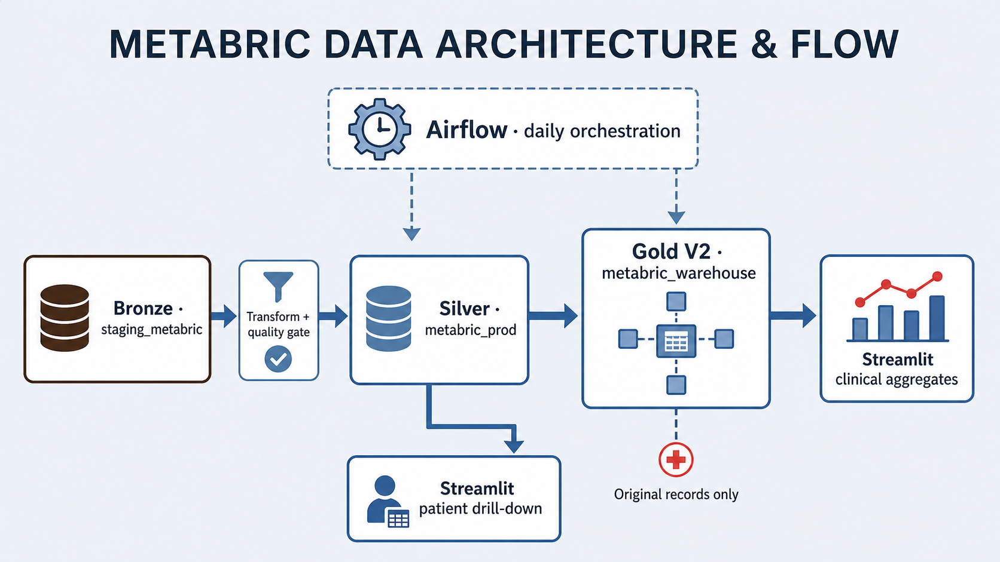
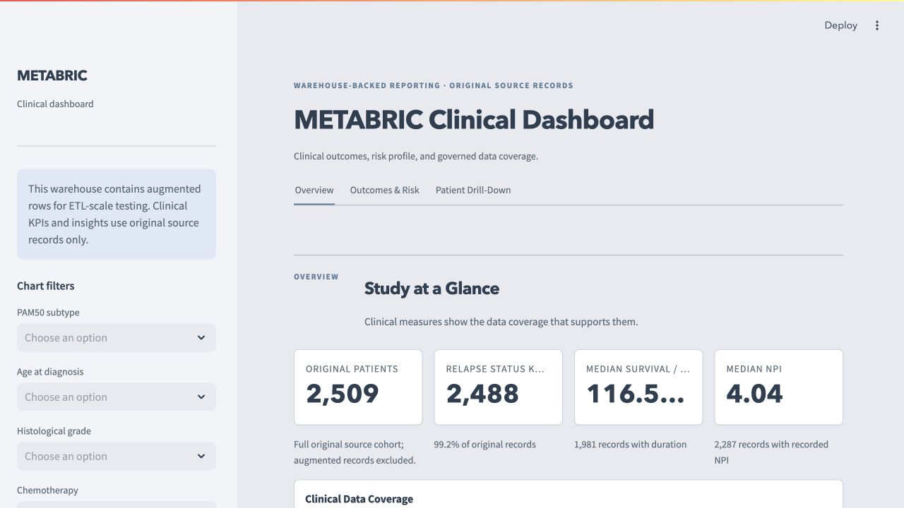
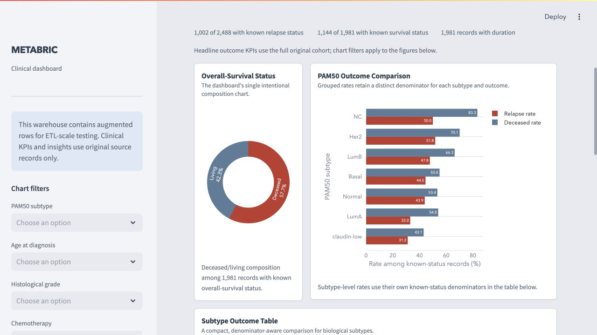
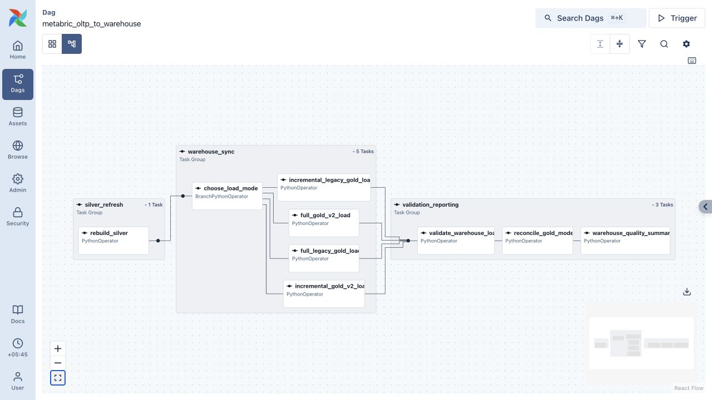
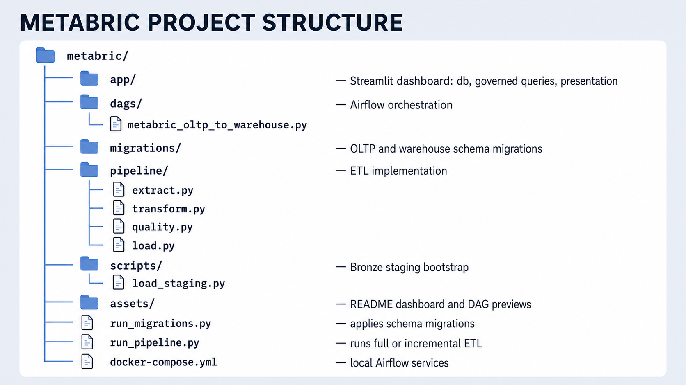

# METABRIC Clinical Data Engineering Platform

A production-style data engineering project built on the METABRIC breast-cancer clinical dataset. It takes a raw clinical extract through Bronze, Silver, and Gold layers, orchestrates warehouse refreshes with Airflow, and presents governed clinical reporting in Streamlit.

The project is designed to demonstrate more than a dashboard: normalized operational modelling, cross-database ETL, quality controls, idempotent warehouse loading, and transparent handling of missing and augmented data.

## Architecture



| Layer | Store | Responsibility |
| --- | --- | --- |
| Bronze | `staging_metabric` | Source CSV staging. |
| Silver | `metabric_prod` | Clean, normalized patient, pathology, treatment, and outcome records. |
| Gold | `metabric_warehouse` | Analytical facts and dimensions for clinical reporting. |
| Presentation | Streamlit | Gold-based aggregates and Silver-only patient-level review. |

Two physical PostgreSQL databases are used intentionally. The OLTP and warehouse stores cannot be joined in a single SQL query, so the warehouse loader resolves cross-database relationships in Python—mirroring a real ETL boundary.

## Gold clinical model

Gold V2 is the canonical clinical star schema used by the dashboard. Its central fact, `fact_clinical_outcomes_v2`, stores clinical measures, survival and relapse endpoints, source-batch information, and derived event flags. It joins to dimensions for patients, tumour characteristics, molecular subtypes, and treatments.

The earlier Gold model remains temporarily alongside V2. Both are refreshed and reconciled during the transition, providing a practical migration and verification path rather than replacing an analytical model without comparison.

## Data governance

- The fixed source cohort contains **2,509 original records**.
- `SYN-*` records are bootstrap-augmented copies used only to demonstrate warehouse-scale processing; they are never used for clinical interpretation.
- Every clinical aggregate filters to original records at query level. The dashboard discloses this persistently.
- Rates, medians, and distributions show their relevant denominator or coverage. Missing status is never interpreted as a negative event.
- Synthetic diagnosis dates are excluded from clinical conclusions, and `cohort` is treated as a source-batch watermark—not a clinical time series.
- Gold retains a `record_origin` field (`original` or `augmented`) so this rule is explicit in the canonical analytical model.

## Pipeline behaviour

Silver is a deterministic full rebuild from the fixed source on every run. Gold supports two modes:

- `full` rebuilds the warehouse from Silver and is used for initialisation or recovery.
- `incremental` loads only source batches above the current cohort watermark. It is safe to retry after a successful full baseline.

Each Gold model is loaded in its own atomic warehouse transaction. Airflow validates both models after the selected load path and reconciles their fact counts, watermarks, and original-record coverage before marking the run successful.

## Dashboard

The Streamlit app is a single clinical analytics experience with three views:

- **Overview** — data coverage, cohort composition, pathology, treatment, and warehouse provenance.
- **Outcomes & Risk** — known-status outcome KPIs and subtype/risk comparisons.
- **Patient Drill-Down** — original-record clinical history from Silver, including fields intentionally excluded from Gold aggregates.

All SQL lives in `app/queries.py`; `app/main.py` contains presentation and interaction logic only.

## Dashboard preview

<p align="center">
  <a href="assets/dashboard-overview.jpg"></a>
  <a href="assets/dashboard-outcomes-risk.jpg"></a>
</p>

## Orchestration preview

<a href="assets/airflow-expanded-dag.jpg"></a>

Daily Airflow DAG with selectable full or incremental Gold paths and post-load reconciliation.

## Project structure



## Run locally

Create `metabric_prod` and `metabric_warehouse`, then copy `.env.example` to `.env` and provide both database configurations. Place the source file at `data/staging_metabric.csv`.

```bash
.venv/bin/python run_migrations.py --target oltp
.venv/bin/python run_migrations.py --target warehouse
.venv/bin/python scripts/load_staging.py
.venv/bin/python run_pipeline.py --mode full
.venv/bin/streamlit run app/main.py
```

After the initial load, use the incremental path when appropriate:

```bash
.venv/bin/python run_pipeline.py --mode incremental
```

To run orchestration locally:

```bash
docker compose up --build
```

Open the local Airflow web interface, unpause `metabric_oltp_to_warehouse`, and use a manual `full` run for initialisation. The DAG is scheduled daily and defaults to `incremental`; it can also be triggered on demand for a demo or recovery run.

## Stack

PostgreSQL · Python · pandas · psycopg2 · Faker · Apache Airflow · Docker Compose · Streamlit · Plotly

## Clinical-use note

This is an educational analytics engineering project, not a clinical decision-support tool. Outcome comparisons are descriptive associations in an observational dataset and should not be interpreted as treatment effects.
